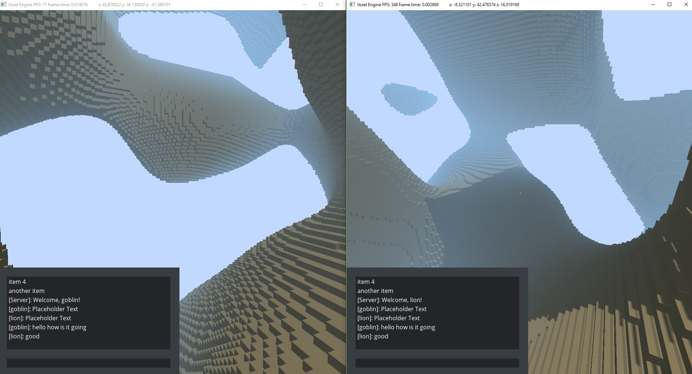
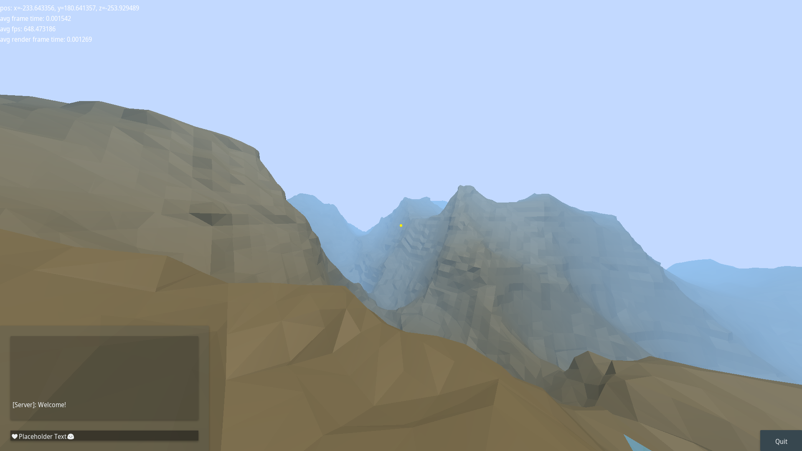
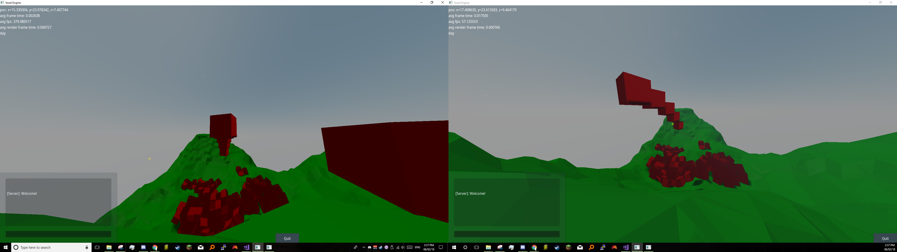
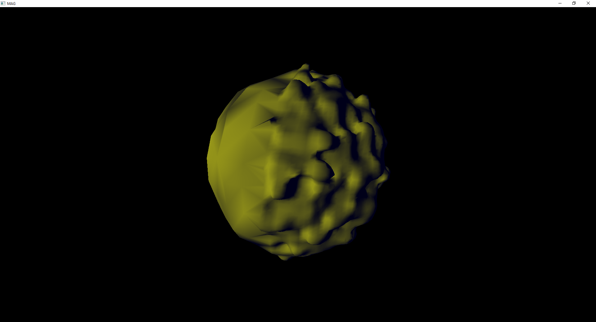

+++
title = "Voxel Game Engine Prototype"
date = 2019-12-31
[extra]
+++

This is a project I started a long time ago to learn computer graphics and game engine development. 
Here are some screenshots over the years showcasing its development. It was written in C++ and the renderer used OpenGL 4. It supported client-server multiplayer using ENet, and featured an authentication system as well. Lua scripting support was added using sol2. The Bullet3 physics engine was used for collision detection.

---

## Infinite Terrain with Fog
<!--  -->

{{ image(path="fog.png", width=600, alt="fog") }}

---

## Lighting
<!--  -->

{{ image(path="day_lighting.png", width=600, alt="Lighting") }}

---

## Deferred Shading with Shadow Map
<!--  -->

{{ image(path="shadows2.png", width=600, alt="Deferred Shading with Shadow Map") }}

---

## Multiplayer
<!--  -->

{{ image(path="multiplayer.png", width=600, alt="Multiplayer") }}

---

## Main Menu
<!--  -->

{{ image(path="mainmenu.png", width=600, alt="Main Menu") }}

---

## Debug Visualization of Idle Animation
<!--  -->

{{ image(path="idle.png", width=600, alt="Debug Visualization of Idle Animation") }}

---

## Smooth Terrain (Marching Cubes Method)
<!--  -->

{{ image(path="terrain2.png", width=600, alt="Smooth Terrain (Marching Cubes Method)") }}

---

## Mountainous Terrain
<!--  -->

{{ image(path="mountains.png", width=600, alt="Mountainous Terrain") }}

---

## Integration of Sky Shader
<!--  -->

{{ image(path="skyshader.png", width=600, alt="Integration of Sky Shader") }}

---

## Multiplayer Deterministic Physics
<!--  -->

{{ image(path="multiplayer_physics.png", width=600, alt="Multiplayer Deterministic Physics") }}

---

## Trees (Implementation of Asset Pipeline)
<!--  -->

{{ image(path="trees.png", width=600, alt="Trees (Implementation of Asset Pipeline)") }}

---

## More Point Lights
<!--  -->

{{ image(path="lights.png", width=600, alt="More Point Lights") }}

---

## Player Model
<!--  -->

{{ image(path="playermodels.png", width=600, alt="Player Model") }}

---

## First Person View
<!--  -->

{{ image(path="first_person.png", width=600, alt="First Person View") }}

---

## Better Shadows
<!--  -->

{{ image(path="better_shadows.png", width=600, alt="Better Shadows") }}

---

## PBR Terrain Textures
<!--  -->

{{ image(path="sphere.png", width=600, alt="PBR Terrain Textures") }}

---

## Large-Scale Dual Contouring with LOD System (Vulkan)
<!--  -->

{{ image(path="dc.png", width=600, alt="Large-Scale Dual Contouring with LOD System (Vulkan)") }}
